# qBittorrent VPN Configuration Fix

## Problem Summary

qBittorrent was not downloading or uploading torrents despite having a working VPN connection through Gluetun. The issue was caused by multiple configuration problems that prevented torrents from properly routing through the VPN tunnel.

## Root Causes Identified

### 1. Missing Container Command Arguments
- **Issue**: The `qbittorrentofficial/qbittorrent-nox` container was exiting immediately with code 0
- **Cause**: Container lacked explicit command and args to run qbittorrent-nox in daemon mode
- **Symptom**: Container in CrashLoopBackOff state with only tini warnings in logs

### 2. VPN Endpoint Hostname Resolution
- **Issue**: Gluetun could not connect to VPN server using hostname
- **Cause**: `WIREGUARD_ENDPOINT_IP` was set to `ca3.vpn.airdns.org` instead of IP address
- **Solution**: Resolved hostname to `184.75.208.244` and updated configuration

### 3. Network Interface Binding Missing
- **Issue**: qBittorrent was not bound to the VPN tunnel interface
- **Cause**: Missing `Session\Interface=tun0` and `Session\InterfaceName=tun0` in qBittorrent.conf
- **Symptom**: Torrents not downloading despite VPN connection being active

## Solution Implemented

### Phase 1: Fix Container Startup
Updated `qbittorrent-vpn.yaml` to include proper command and args:
```yaml
- name: qbittorrent
  image: qbittorrentofficial/qbittorrent-nox:latest
  command: ["qbittorrent-nox"]
  args: ["--webui-port=8080", "--profile=/config"]
```

### Phase 2: Fix VPN Endpoint
Resolved hostname to IP address in the AirVPN secret configuration:
```yaml
stringData:
  WIREGUARD_ENDPOINT_IP: "184.75.208.244"  # Was: ca3.vpn.airdns.org
  WIREGUARD_ENDPOINT_PORT: "1637"
```

### Phase 3: Add Network Interface Binding
Added interface binding to qBittorrent configuration:
```ini
[BitTorrent]
Session\Interface=tun0
Session\InterfaceName=tun0
Session\Port=23059
```

### Phase 4: Switch to Native AirVPN Provider (FINAL SOLUTION)
**Problem**: AirVPN uses DNS round-robin for `ca3.vpn.airdns.org`, causing IP addresses to change frequently:
- Original: `184.75.208.244` (worked initially) 
- Later: `199.189.27.125` (caused connection failures)
- Current: `184.75.221.213` (would require constant updates)

**Solution**: Switch from custom provider to Gluetun's native AirVPN support:

```yaml
stringData:
  # Native AirVPN provider - handles DNS automatically
  VPN_SERVICE_PROVIDER: "airvpn"
  VPN_TYPE: "wireguard"
  WIREGUARD_PRIVATE_KEY: "your-private-key"
  WIREGUARD_PRESHARED_KEY: "your-preshared-key"
  WIREGUARD_ADDRESSES: "10.186.123.240/32,fd7d:76ee:e68f:a993:e2ea:da21:fba4:80f9/128"
  # Optional settings
  WIREGUARD_MTU: "1320"
  FIREWALL: "on"
  VPN_PORT_FORWARDING: "off"
  FIREWALL_VPN_INPUT_PORTS: "23059"
```

**Benefits of Native Provider**:
- ✅ Automatic DNS resolution - no more IP tracking
- ✅ Server failover if one endpoint is down
- ✅ Handles AirVPN server changes seamlessly
- ✅ Future-proof configuration
- ✅ Supports both IPv4 and IPv6 addresses

### Phase 5: Permanent Configuration Management
Added ConfigMap and initContainer to ensure proper configuration on pod restarts:

1. **ConfigMap** with complete qBittorrent configuration including VPN binding
2. **InitContainer** that:
   - Creates initial config if none exists
   - Adds VPN binding to existing configs if missing
   - Ensures configuration survives pod restarts

## Verification Steps

After implementing the fix, verify torrents are working:

1. **Check pod status**:
   ```bash
   kubectl get pods -n media | grep qbittorrent
   # Should show 2/2 Running
   ```

2. **Verify VPN connection**:
   ```bash
   kubectl exec -n media deployment/qbittorrent-vpn -c gluetun -- wget -qO- ipinfo.io
   # Should show AirVPN server details (Canada, Toronto)
   ```

3. **Check interface binding**:
   ```bash
   kubectl exec -n media deployment/qbittorrent-vpn -c qbittorrent -- \
     cat /config/qBittorrent/config/qBittorrent.conf | grep Interface
   # Should show: Session\Interface=tun0
   ```

4. **Verify port forwarding is working**:
   ```bash
   # Check port is listening on VPN interface
   kubectl exec -n media deployment/qbittorrent-vpn -c gluetun -- netstat -tuln | grep 23059
   # Should show port listening on tun0 interface (both IPv4 and IPv6)
   
   # Verify peers are connecting
   kubectl exec -n media deployment/qbittorrent-vpn -c gluetun -- netstat -tun | grep 23059 | head -10
   # Should show active peer connections from various IPs
   
   # Check firewall statistics
   kubectl exec -n media deployment/qbittorrent-vpn -c gluetun -- iptables -L INPUT -n -v | grep 23059
   # Should show packet counts indicating traffic
   ```

5. **Verify DNS handling (shows native provider benefits)**:
   ```bash
   # Check which server endpoint was selected
   kubectl logs -n media deployment/qbittorrent-vpn -c gluetun | grep "Connecting to"
   # Shows automatic server selection without hardcoded IPs
   ```

## Configuration Details

### Complete VPN Configuration (Native AirVPN Provider)
```yaml
stringData:
  # Required variables for native AirVPN
  VPN_SERVICE_PROVIDER: "airvpn"
  VPN_TYPE: "wireguard"
  WIREGUARD_PRIVATE_KEY: "6PPILvqyKKZsrJlCuhbA8fNCNjJnXYvEgbkefn3joGM="
  WIREGUARD_PRESHARED_KEY: "wBgcWM8yENsysegPAL9/RKw4XWc93zVoYNT0Dn9pfjA="
  WIREGUARD_ADDRESSES: "10.186.123.240/32,fd7d:76ee:e68f:a993:e2ea:da21:fba4:80f9/128"
  
  # Optional settings to preserve existing configuration
  WIREGUARD_MTU: "1320"
  FIREWALL: "on"
  DOT: "off"
  VPN_PORT_FORWARDING: "off"  # AirVPN handles port forwarding
  FIREWALL_VPN_INPUT_PORTS: "23059"  # Your forwarded port
  WIREGUARD_PERSISTENT_KEEPALIVE: "15"
```

**Key Changes from Custom Provider**:
- ❌ **Removed**: `WIREGUARD_ENDPOINT_IP`, `WIREGUARD_ENDPOINT_PORT`, `WIREGUARD_PUBLIC_KEY`
- ✅ **Added**: Native provider handling with `VPN_SERVICE_PROVIDER: "airvpn"`
- ✅ **Enhanced**: Full IPv6 support with dual-stack addressing

### Critical qBittorrent Settings
```ini
[BitTorrent]
Session\Interface=tun0                    # Bind to VPN interface
Session\InterfaceName=tun0               # Interface name
Session\Port=23059                       # Must match FIREWALL_VPN_INPUT_PORTS

[Preferences]  
WebUI\AuthSubnetWhitelist=10.42.0.0/16  # Allow Kubernetes pod subnet
WebUI\AuthSubnetWhitelistEnabled=true   # Enable subnet whitelist
```

## Troubleshooting

### Issue: Container Still Crashing
- Check if command and args are properly set in deployment
- Verify PVC mounts are working
- Check initContainer logs: `kubectl logs -n media deployment/qbittorrent-vpn -c config-init`

### Issue: VPN Not Connecting  
- **With native provider**: Check AirVPN credentials in Config Generator
- **With custom provider**: Ensure `WIREGUARD_ENDPOINT_IP` is current IP, not hostname
- Verify VPN credentials are correct
- Check Gluetun logs: `kubectl logs -n media deployment/qbittorrent-vpn -c gluetun`

### Issue: DNS Resolution Problems (custom provider)
- **Symptom**: Endpoint IPs change frequently, connection fails
- **Cause**: AirVPN uses DNS round-robin for load balancing
- **Solution**: Switch to native AirVPN provider which handles DNS automatically

### Issue: Torrents Not Downloading
- Verify interface binding is set in qBittorrent.conf
- Check if port 23059 is listening on tun0 interface
- Ensure port forwarding is configured in VPN provider

### Issue: API Access from Radarr/Sonarr
- Add Kubernetes pod subnet to qBittorrent whitelist: `10.42.0.0/16`
- Verify qBittorrent WebUI is accessible from other pods

## Files Modified

1. **k8s/homelab/media/qbittorrent-vpn.yaml**
   - Phase 1-3: Added ConfigMap, initContainer, and proper container configuration
   - Phase 4: **Switched to native AirVPN provider** (final solution)
   - Removed hardcoded endpoint IPs that change with DNS round-robin
   - Added IPv6 support with dual-stack addressing

2. **Created: docs/QBITTORRENT_VPN_FIX.md** (this file)
   - Documents complete troubleshooting journey
   - Includes network architecture diagram
   - Updated with native AirVPN solution

## Future Maintenance

- **Native AirVPN provider**: No maintenance required for IP changes
- The ConfigMap ensures proper configuration on fresh deployments
- The initContainer handles upgrades by adding VPN binding to existing configs
- Configuration persists across pod restarts and cluster rebuilds
- **DNS changes handled automatically** - no more IP tracking needed

## Complete Homelab Network Architecture 🌐

This diagram shows ALL network paths, containers, and security boundaries in our Kubernetes homelab:

```mermaid
graph TB
    subgraph "🌍 INTERNET (EXTERNAL WORLD)"
        Internet[☁️ Public Internet]
        CF[🔶 Cloudflare<br/>CDN & Tunnel]
        AirVPN[🔐 AirVPN Server<br/>Canada: 184.75.208.247]
        Peers[👥 Torrent Peers<br/>Worldwide]
    end

    subgraph "🏠 HOME NETWORK (172.23.25.0/24)"
        Router[📡 Home Router<br/>Your Real ISP IP]
        
        subgraph "🖥️ WSL2 UBUNTU - KUBERNETES CLUSTER"
            
            subgraph "⚙️ SYSTEM NAMESPACE"
                subgraph "Ingress Controller"
                    Traefik[🚦 Traefik<br/>Reverse Proxy<br/>*.home.lab]
                end
                
                subgraph "Load Balancers (MetalLB)"
                    LB_Plex[📊 LB: 172.23.25.244<br/>Plex:32400]
                    LB_Traefik[📊 LB: 172.23.25.249<br/>Traefik:80/443]
                    LB_QB[📊 LB: 172.23.25.245<br/>qBittorrent:8080]
                    LB_Others[📊 LB: 172.23.25.246-250<br/>Other Services]
                end
            end

            subgraph "🎬 MEDIA NAMESPACE"
                subgraph "Media Management"
                    Plex[🎬 Plex<br/>Media Server]
                    Overseerr[📺 Overseerr<br/>Request Management]
                    Radarr[🎥 Radarr<br/>Movies]
                    Sonarr[📡 Sonarr<br/>TV Shows]
                    Prowlarr[🔍 Prowlarr<br/>Indexer]
                end
                
                subgraph "qBittorrent Pod (ISOLATED)"
                    subgraph "Gluetun Container"
                        GluetunVPN[🛡️ VPN Tunnel<br/>WireGuard]
                        Firewall[🔥 Firewall<br/>Port 23059 only]
                    end
                    QB[📦 qBittorrent<br/>Bound to tun0<br/>FORCED through VPN]
                end
            end

            subgraph "☁️ CLOUD SERVICES NAMESPACE"
                NextCloud[☁️ NextCloud<br/>File Storage]
                Immich[📸 Immich<br/>Photos]
            end

            subgraph "🏡 HOME AUTOMATION NAMESPACE"
                HASS[🏠 Home Assistant<br/>Smart Home]
                Mealie[🍳 Mealie<br/>Recipes]
                Grocy[📦 Grocy<br/>Inventory]
            end

            subgraph "🔧 CLOUDFLARE NAMESPACE"
                CFTunnel[🚇 Cloudflared<br/>Tunnel Client<br/>Outbound Only]
            end
        end

        Phone[📱 Your Phone<br/>LAN Device]
        PC[💻 Your PC<br/>LAN Device]
    end

    %% INTERNAL ACCESS PATHS (GREEN = SAFE)
    Phone -->|"✅ http://plex.home.lab"| LB_Traefik
    PC -->|"✅ http://radarr.home.lab"| LB_Traefik
    LB_Traefik --> Traefik
    Traefik -->|"Internal routing"| Plex
    Traefik -->|"Internal routing"| Overseerr
    Traefik -->|"Internal routing"| Radarr
    Traefik -->|"Internal routing"| Sonarr
    Traefik -->|"Internal routing"| NextCloud
    Traefik -->|"Internal routing"| HASS
    
    %% EXTERNAL ACCESS PATHS (YELLOW = ENCRYPTED)
    Internet -->|"🔒 HTTPS"| CF
    CF -->|"🔒 Encrypted Tunnel"| CFTunnel
    CFTunnel -->|"⚠️ OUTBOUND ONLY"| CF
    CFTunnel -->|"Internal only"| Traefik
    
    %% VPN TORRENT PATH (RED = ISOLATED)
    QB -.->|"❌ BLOCKED"| Router
    QB -->|"🔴 FORCED THROUGH VPN"| GluetunVPN
    GluetunVPN -->|"🔐 WireGuard Encrypted"| AirVPN
    AirVPN -->|"Appears as VPN IP"| Peers
    
    %% INTERNAL SERVICE COMMUNICATION
    Radarr -->|"API calls"| QB
    Sonarr -->|"API calls"| QB
    Prowlarr -->|"Search queries"| Radarr
    Prowlarr -->|"Search queries"| Sonarr
    
    %% DIRECT EXTERNAL ACCESS (SPECIAL CASES)
    Phone -->|"✅ Direct IP:32400"| LB_Plex
    LB_Plex --> Plex

    %% Security Classification
    classDef internet fill:#ff6b6b,stroke:#c0392b,color:#fff,stroke-width:3px
    classDef vpn fill:#e67e22,stroke:#d35400,color:#fff,stroke-width:3px
    classDef safe fill:#27ae60,stroke:#229954,color:#fff
    classDef internal fill:#3498db,stroke:#2874a6,color:#fff
    classDef tunnel fill:#f39c12,stroke:#d68910,color:#fff,stroke-width:2px
    
    class Internet,CF,AirVPN,Peers internet
    class GluetunVPN,Firewall,QB vpn
    class Traefik,LB_Plex,LB_Traefik,LB_QB,LB_Others safe
    class Plex,Overseerr,Radarr,Sonarr,Prowlarr,NextCloud,HASS,Immich,Mealie,Grocy internal
    class CFTunnel tunnel
```



### 🔒 Network Security Boundaries Explained

#### External Contact Points (RED ZONES - Internet Facing):
1. **Cloudflare Tunnel** 🚇
   - **Direction**: OUTBOUND ONLY (cluster → Cloudflare)
   - **Security**: Encrypted tunnel, no inbound ports open
   - **Access**: Selected services only (Plex, Overseerr, NextCloud, etc.)

2. **AirVPN Connection** 🔐
   - **Purpose**: Torrent traffic ONLY
   - **Security**: WireGuard encryption + firewall
   - **Isolation**: qBittorrent cannot access anything else

3. **MetalLB Load Balancers** 📊
   - **Scope**: LAN ONLY (172.23.25.x subnet)
   - **External**: NO direct internet access
   - **Purpose**: Internal service discovery

#### Internal Access Paths (GREEN ZONES - Safe):
- **Traefik Ingress**: Routes all *.home.lab domains internally
- **Service Mesh**: Kubernetes internal networking (10.42.0.0/16)
- **Pod-to-Pod**: Direct communication within namespaces

#### What Touches the Internet:
✅ **Cloudflared** → Cloudflare (outbound tunnel)
✅ **Gluetun VPN** → AirVPN (encrypted torrent traffic)
❌ **Everything else** → Isolated in Kubernetes

#### Security Features:
- **qBittorrent**: Bound to tun0, cannot leak
- **Cloudflare Access**: Authentication for external access
- **Network Policies**: Namespace isolation
- **No Port Forwarding**: Router has zero open ports
- **Kill Switch**: VPN failure = torrents stop

### 💡 Why This Is Bulletproof

| Component | Internet Exposure | Protection |
|-----------|------------------|------------|
| Your Real IP | ❌ Never exposed | Hidden behind VPN/Cloudflare |
| Media Services | ✅ Via Cloudflare only | Encrypted tunnel + auth |
| Torrent Traffic | ✅ Via VPN only | WireGuard + kill switch |
| Home Router | ❌ No open ports | All outbound connections |
| Internal Services | ❌ LAN only | Traefik + MetalLB |

**Bottom Line**: Three layers of protection ensure nothing leaks! 🛡️

---

*Original fix implemented on 2025-09-06. Updated on 2025-09-07 with native AirVPN provider solution for automatic DNS handling. This resolves all qBittorrent VPN connectivity issues in the homelab Kubernetes cluster.*