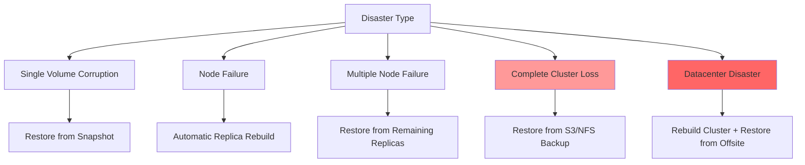
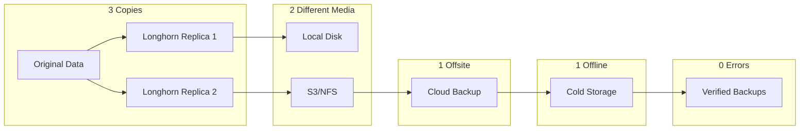
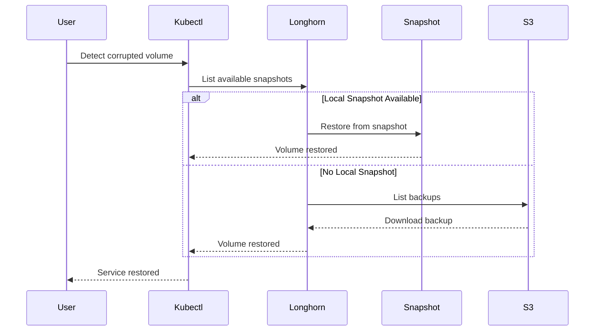
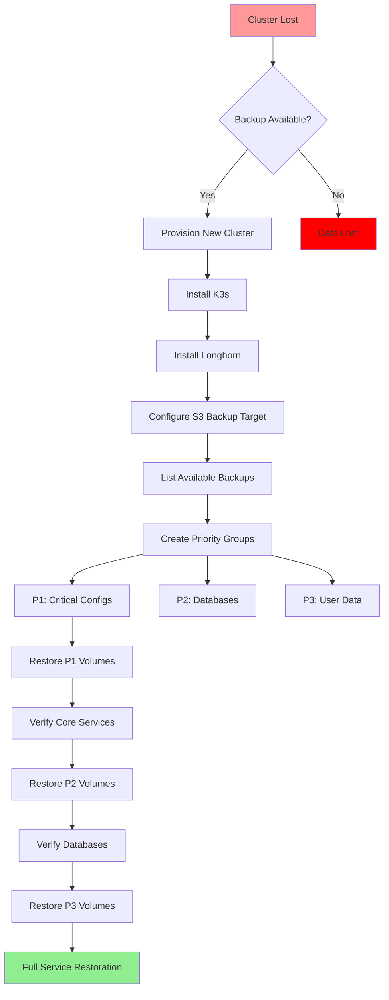
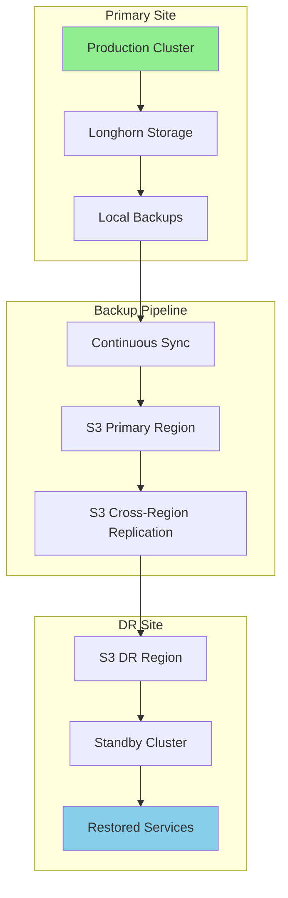
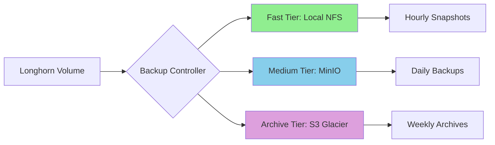
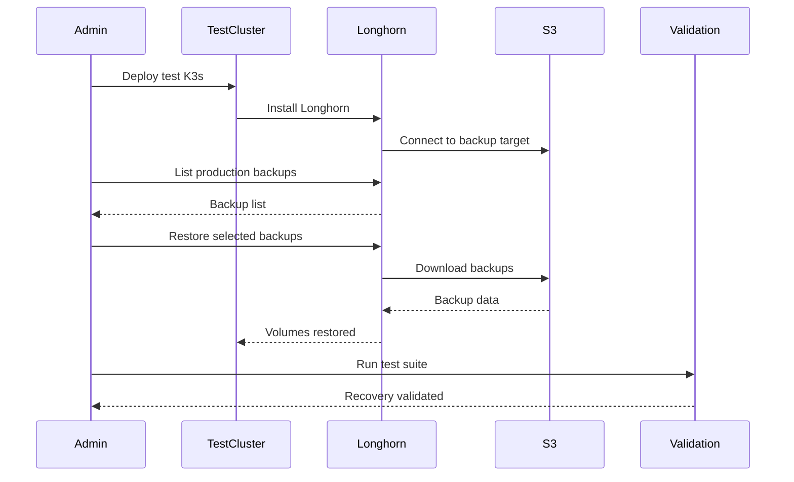
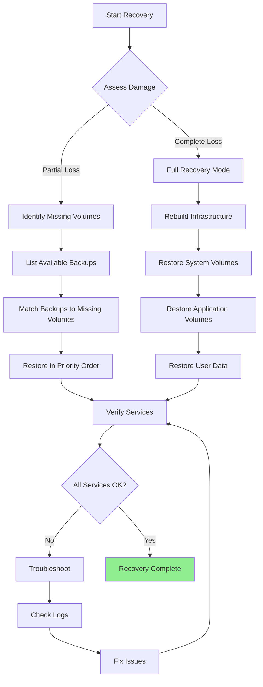
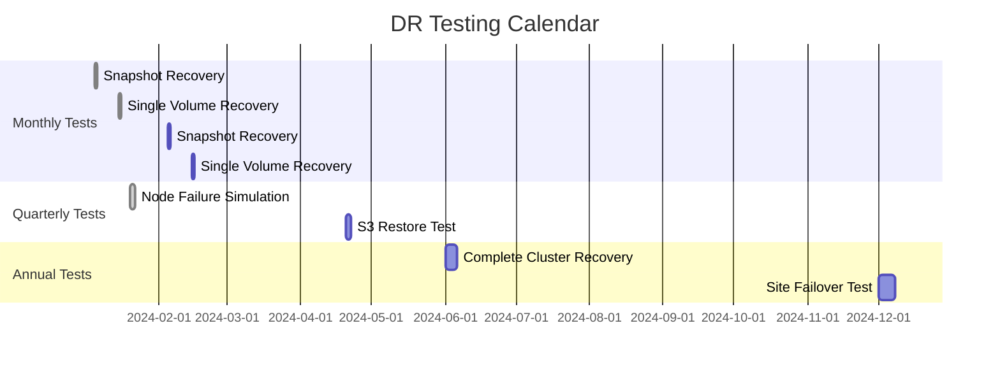

# Longhorn Complete Disaster Recovery Guide

## Table of Contents
1. [Disaster Scenarios Overview](#disaster-scenarios-overview)
2. [Backup Strategies](#backup-strategies)
3. [Recovery Protocols](#recovery-protocols)
4. [Backup Target Options](#backup-target-options)
5. [Automated Backup Configuration](#automated-backup-configuration)
6. [Complete Recovery Procedures](#complete-recovery-procedures)
7. [Testing and Validation](#testing-and-validation)

---

## Disaster Scenarios Overview

### Disaster Types and Recovery Methods



### Recovery Time Objectives (RTO)

| Disaster Level | Data Loss | Recovery Time | Recovery Method |
|---------------|-----------|---------------|-----------------|
| **Volume Corruption** | None | < 5 minutes | Local snapshot |
| **Single Node Failure** | None | < 10 minutes | Automatic failover |
| **Multi-Node Failure** | None | < 30 minutes | Replica rebuild |
| **Complete Cluster Loss** | Up to last backup | 2-4 hours | S3/NFS restore |
| **Site Disaster** | Up to last offsite backup | 4-8 hours | Full rebuild |

---

## Backup Strategies

### 3-2-1-1-0 Backup Rule for Kubernetes



### Backup Frequency Matrix

| Data Type | Snapshot Frequency | S3 Backup | Retention | Priority |
|-----------|-------------------|-----------|-----------|----------|
| **Critical Configs** | Every 1h | Daily | 30 days | P1 |
| **Databases** | Every 6h | Twice daily | 14 days | P1 |
| **Personal Files** | Daily | Daily | 90 days | P2 |
| **Application Data** | Every 12h | Weekly | 30 days | P3 |
| **Media Libraries** | Weekly | Never | 7 days | P4 |
| **Temporary/Downloads** | Never | Never | None | P5 |

---

## Recovery Protocols

### Protocol 1: Single Volume Recovery



**Recovery Commands:**
```bash
# Option 1: Restore from local snapshot
kubectl apply -f - <<EOF
apiVersion: v1
kind: PersistentVolumeClaim
metadata:
  name: restored-pvc
  namespace: original-namespace
spec:
  storageClassName: longhorn
  dataSource:
    name: snapshot-name
    kind: VolumeSnapshot
    apiGroup: snapshot.storage.k8s.io
  accessModes:
    - ReadWriteOnce
  resources:
    requests:
      storage: 10Gi
EOF

# Option 2: Restore from S3 backup
kubectl apply -f - <<EOF
apiVersion: longhorn.io/v1beta1
kind: Volume
metadata:
  name: restore-from-s3
  namespace: longhorn-system
spec:
  fromBackup: "s3://longhorn-backups@us-east-1/backups/backup-xyz"
  dataSource: pvc-original
EOF
```

### Protocol 2: Complete Cluster Loss Recovery



**Recovery Script:**
```bash
#!/bin/bash
# disaster-recovery.sh - Complete cluster recovery from S3

# Step 1: Install fresh K3s cluster
curl -sfL https://get.k3s.io | sh -

# Step 2: Install Longhorn
kubectl apply -f https://raw.githubusercontent.com/longhorn/longhorn/v1.5.3/deploy/longhorn.yaml

# Step 3: Wait for Longhorn
kubectl wait --for=condition=ready pod -l app=longhorn-manager -n longhorn-system --timeout=300s

# Step 4: Configure S3 backup target
kubectl apply -f - <<EOF
apiVersion: v1
kind: Secret
metadata:
  name: s3-backup-secret
  namespace: longhorn-system
stringData:
  AWS_ACCESS_KEY_ID: "${AWS_ACCESS_KEY_ID}"
  AWS_SECRET_ACCESS_KEY: "${AWS_SECRET_ACCESS_KEY}"
EOF

kubectl patch settings.longhorn.io backup-target -n longhorn-system --type='merge' -p \
  '{"value":"s3://disaster-recovery@us-east-1/"}'

kubectl patch settings.longhorn.io backup-target-credential-secret -n longhorn-system --type='merge' -p \
  '{"value":"s3-backup-secret"}'

# Step 5: List and restore backups
echo "Fetching backup list..."
kubectl get backups.longhorn.io -n longhorn-system

# Step 6: Restore critical volumes first
for backup in $(kubectl get backups.longhorn.io -n longhorn-system -o json | jq -r '.items[] | select(.metadata.labels.priority=="P1") | .metadata.name'); do
  echo "Restoring P1 backup: $backup"
  kubectl apply -f - <<EOF
apiVersion: longhorn.io/v1beta1
kind: Volume
metadata:
  name: restored-${backup}
  namespace: longhorn-system
spec:
  fromBackup: "${backup}"
  numberOfReplicas: 3
EOF
done
```

### Protocol 3: Site Disaster Recovery (Multi-Region)



---

## Backup Target Options

### Option 1: AWS S3

```yaml
# S3 Configuration
apiVersion: v1
kind: Secret
metadata:
  name: s3-backup-secret
  namespace: longhorn-system
stringData:
  AWS_ACCESS_KEY_ID: "your-access-key"
  AWS_SECRET_ACCESS_KEY: "your-secret-key"
  AWS_DEFAULT_REGION: "us-east-1"
---
# Longhorn Settings
backup-target: "s3://longhorn-backups@us-east-1/"
backup-target-credential-secret: "s3-backup-secret"

# Cost Optimization with Lifecycle
# Use S3 Glacier for old backups
aws s3api put-bucket-lifecycle-configuration --bucket longhorn-backups \
  --lifecycle-configuration file://lifecycle.json

# lifecycle.json:
{
  "Rules": [{
    "Id": "ArchiveOldBackups",
    "Status": "Enabled",
    "Transitions": [{
      "Days": 30,
      "StorageClass": "GLACIER"
    }]
  }]
}
```

### Option 2: MinIO (Self-Hosted S3)

```yaml
# Deploy MinIO for on-premise S3
apiVersion: apps/v1
kind: Deployment
metadata:
  name: minio
  namespace: backup-system
spec:
  template:
    spec:
      containers:
      - name: minio
        image: minio/minio:latest
        args:
        - server
        - /data
        - --console-address
        - ":9001"
        env:
        - name: MINIO_ROOT_USER
          value: "admin"
        - name: MINIO_ROOT_PASSWORD
          value: "changeme123"
        volumeMounts:
        - name: storage
          mountPath: /data
      volumes:
      - name: storage
        persistentVolumeClaim:
          claimName: minio-storage
---
# Configure Longhorn to use MinIO
backup-target: "s3://longhorn-backups@minio-service.backup-system.svc.cluster.local:9000/"
```

### Option 3: NFS Backup Target

```yaml
# NFS Server Setup
apiVersion: apps/v1
kind: Deployment
metadata:
  name: nfs-server
  namespace: backup-system
spec:
  template:
    spec:
      containers:
      - name: nfs-server
        image: itsthenetwork/nfs-server-alpine:latest
        env:
        - name: SHARED_DIRECTORY
          value: "/exports"
        securityContext:
          privileged: true
        volumeMounts:
        - name: storage
          mountPath: /exports
      volumes:
      - name: storage
        persistentVolumeClaim:
          claimName: nfs-backup-storage
---
# Configure Longhorn for NFS
backup-target: "nfs://nfs-server.backup-system.svc.cluster.local:/exports"
```

### Option 4: Backblaze B2 (S3-Compatible)

```bash
# Backblaze B2 Configuration
export B2_ACCOUNT_ID="your-account-id"
export B2_APPLICATION_KEY="your-app-key"
export B2_BUCKET="longhorn-backups"
export B2_ENDPOINT="s3.us-west-001.backblazeb2.com"

# Create secret
kubectl create secret generic b2-backup-secret \
  -n longhorn-system \
  --from-literal=AWS_ACCESS_KEY_ID="${B2_ACCOUNT_ID}" \
  --from-literal=AWS_SECRET_ACCESS_KEY="${B2_APPLICATION_KEY}" \
  --from-literal=AWS_ENDPOINTS="${B2_ENDPOINT}"

# Configure Longhorn
backup-target: "s3://${B2_BUCKET}@${B2_ENDPOINT}/"
```

### Option 5: Hybrid Multi-Target Backup



---

## Automated Backup Configuration

### Recurring Backup Jobs

```yaml
# Critical Config Backup Job
apiVersion: longhorn.io/v1beta1
kind: RecurringJob
metadata:
  name: backup-critical-hourly
  namespace: longhorn-system
spec:
  cron: "0 * * * *"  # Every hour
  task: "backup"
  groups:
  - "critical"
  retain: 24  # Keep 24 hourly backups
  concurrency: 2
  labels:
    priority: "P1"
    type: "config"
---
# Database Backup Job
apiVersion: longhorn.io/v1beta1
kind: RecurringJob
metadata:
  name: backup-database-6h
  namespace: longhorn-system
spec:
  cron: "0 */6 * * *"  # Every 6 hours
  task: "backup"
  groups:
  - "database"
  retain: 8  # Keep 2 days worth
  concurrency: 1
  labels:
    priority: "P1"
    type: "database"
---
# User Data Backup Job
apiVersion: longhorn.io/v1beta1
kind: RecurringJob
metadata:
  name: backup-userdata-daily
  namespace: longhorn-system
spec:
  cron: "0 2 * * *"  # 2 AM daily
  task: "backup"
  groups:
  - "userdata"
  retain: 30  # Keep 30 days
  concurrency: 3
  labels:
    priority: "P2"
    type: "personal"
---
# Snapshot Cleanup Job
apiVersion: longhorn.io/v1beta1
kind: RecurringJob
metadata:
  name: snapshot-cleanup-weekly
  namespace: longhorn-system
spec:
  cron: "0 3 * * 0"  # Sunday 3 AM
  task: "snapshot-cleanup"
  retain: 5
  concurrency: 1
```

### Volume Labeling for Automatic Backups

```yaml
# Label volumes for automatic backup
apiVersion: longhorn.io/v1beta1
kind: Volume
metadata:
  name: home-assistant-config
  namespace: longhorn-system
  labels:
    recurring-job.longhorn.io/backup-critical-hourly: "enabled"
    recurring-job-group.longhorn.io/critical: "enabled"
    backup-priority: "P1"
spec:
  numberOfReplicas: 3
---
# PVC with backup annotations
apiVersion: v1
kind: PersistentVolumeClaim
metadata:
  name: nextcloud-data
  annotations:
    longhorn.io/recurring-job-selector: |
      [
        {
          "name": "backup-userdata-daily",
          "isGroup": false
        }
      ]
spec:
  storageClassName: longhorn
  accessModes:
    - ReadWriteOnce
  resources:
    requests:
      storage: 100Gi
```

---

## Complete Recovery Procedures

### Procedure 1: Test Environment Recovery



**Test Recovery Script:**
```bash
#!/bin/bash
# test-recovery.sh - Validate backup recovery process

# Create test namespace
kubectl create namespace recovery-test

# Restore a test backup
LATEST_BACKUP=$(kubectl get backups.longhorn.io -n longhorn-system \
  -o json | jq -r '.items[0].metadata.name')

kubectl apply -f - <<EOF
apiVersion: v1
kind: PersistentVolumeClaim
metadata:
  name: test-restore
  namespace: recovery-test
spec:
  storageClassName: longhorn
  dataSource:
    name: ${LATEST_BACKUP}
    kind: VolumeBackup
    apiGroup: longhorn.io
  accessModes:
    - ReadWriteOnce
  resources:
    requests:
      storage: 10Gi
EOF

# Deploy test pod to validate data
kubectl apply -f - <<EOF
apiVersion: v1
kind: Pod
metadata:
  name: validate-restore
  namespace: recovery-test
spec:
  containers:
  - name: validator
    image: busybox
    command: ['sh', '-c', 'ls -la /data && md5sum /data/* && sleep 3600']
    volumeMounts:
    - name: restored-data
      mountPath: /data
  volumes:
  - name: restored-data
    persistentVolumeClaim:
      claimName: test-restore
EOF

# Check restoration
kubectl logs -n recovery-test validate-restore
```

### Procedure 2: Incremental Recovery



### Procedure 3: Point-in-Time Recovery

```bash
#!/bin/bash
# point-in-time-recovery.sh - Restore to specific timestamp

TARGET_TIME="2024-01-15T10:30:00Z"
NAMESPACE="production"

# Find backups before target time
kubectl get backups.longhorn.io -n longhorn-system -o json | \
  jq -r --arg time "$TARGET_TIME" \
  '.items[] | select(.metadata.creationTimestamp < $time) | .metadata.name' | \
  sort -r | head -1

# Restore each volume to that point
for volume in $(kubectl get pvc -n $NAMESPACE -o name); do
  VOLUME_NAME=$(echo $volume | cut -d/ -f2)
  
  # Find matching backup
  BACKUP=$(kubectl get backups.longhorn.io -n longhorn-system \
    -l volume=$VOLUME_NAME \
    -o json | jq -r --arg time "$TARGET_TIME" \
    '.items[] | select(.metadata.creationTimestamp < $time) | .metadata.name' | \
    sort -r | head -1)
  
  if [ ! -z "$BACKUP" ]; then
    echo "Restoring $VOLUME_NAME from backup $BACKUP"
    kubectl apply -f - <<EOF
apiVersion: v1
kind: PersistentVolumeClaim
metadata:
  name: ${VOLUME_NAME}-pit-restore
  namespace: ${NAMESPACE}
spec:
  storageClassName: longhorn
  dataSource:
    name: ${BACKUP}
    kind: VolumeBackup
    apiGroup: longhorn.io
  accessModes:
    - ReadWriteOnce
  resources:
    requests:
      storage: $(kubectl get pvc $VOLUME_NAME -n $NAMESPACE -o jsonpath='{.spec.resources.requests.storage}')
EOF
  fi
done
```

---

## Testing and Validation

### Disaster Recovery Testing Schedule



### Automated DR Testing

```yaml
apiVersion: batch/v1
kind: CronJob
metadata:
  name: dr-test-monthly
  namespace: longhorn-system
spec:
  schedule: "0 2 1 * *"  # First day of month, 2 AM
  jobTemplate:
    spec:
      template:
        spec:
          containers:
          - name: dr-test
            image: dr-test:latest
            command:
            - /bin/sh
            - -c
            - |
              # Test snapshot recovery
              kubectl apply -f /tests/snapshot-recovery.yaml
              sleep 60
              kubectl wait --for=condition=ready pod/test-recovery -n test
              
              # Validate data integrity
              kubectl exec test-recovery -n test -- md5sum /data/test-file
              
              # Test S3 backup
              kubectl create backup test-backup-$(date +%s) \
                --volume test-volume -n longhorn-system
              
              # Report results
              curl -X POST $SLACK_WEBHOOK -d \
                '{"text":"DR Test Complete: All systems recoverable"}'
          restartPolicy: OnFailure
```

### Recovery Metrics Dashboard

```yaml
# Grafana Dashboard JSON
{
  "dashboard": {
    "title": "Disaster Recovery Metrics",
    "panels": [
      {
        "title": "Backup Success Rate",
        "targets": [{
          "expr": "rate(longhorn_backup_success_total[24h])"
        }]
      },
      {
        "title": "Time Since Last Backup",
        "targets": [{
          "expr": "time() - longhorn_backup_last_timestamp"
        }]
      },
      {
        "title": "Recovery Time (RTO)",
        "targets": [{
          "expr": "histogram_quantile(0.95, longhorn_restore_duration_seconds)"
        }]
      },
      {
        "title": "Backup Storage Usage",
        "targets": [{
          "expr": "longhorn_backup_target_usage_bytes"
        }]
      }
    ]
  }
}
```

---

## Recovery Checklist

### Pre-Disaster Preparation
- [ ] S3/NFS backup target configured
- [ ] Recurring backup jobs active
- [ ] Backup encryption enabled
- [ ] Off-site backup copy exists
- [ ] Recovery scripts tested
- [ ] Team trained on procedures
- [ ] Contact list updated

### During Disaster
- [ ] Assess damage scope
- [ ] Activate incident response team
- [ ] Communicate with stakeholders
- [ ] Document timeline of events
- [ ] Preserve evidence if needed

### Post-Recovery
- [ ] Verify all services operational
- [ ] Check data integrity
- [ ] Review backup gaps
- [ ] Update disaster recovery plan
- [ ] Conduct post-mortem
- [ ] Test backups again

---

## Summary

This comprehensive disaster recovery guide ensures:

1. **Multiple Backup Targets** - S3, MinIO, NFS, Backblaze B2
2. **Automated Backups** - Recurring jobs based on data criticality
3. **Clear Recovery Protocols** - Step-by-step for each disaster type
4. **Testing Procedures** - Regular validation of backups
5. **Complete Recovery Scripts** - From single volume to entire cluster

With this setup, you can recover from:
- **Corrupted volumes** in minutes using snapshots
- **Failed nodes** automatically with replicas
- **Complete cluster loss** in hours from S3
- **Site disasters** using off-site backups

The key is regular testing and maintaining multiple backup copies across different media and locations.